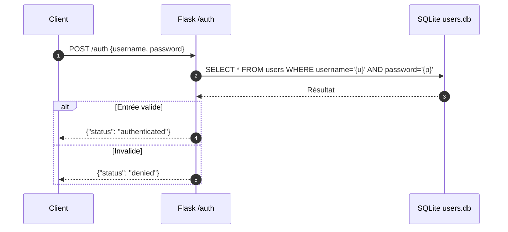
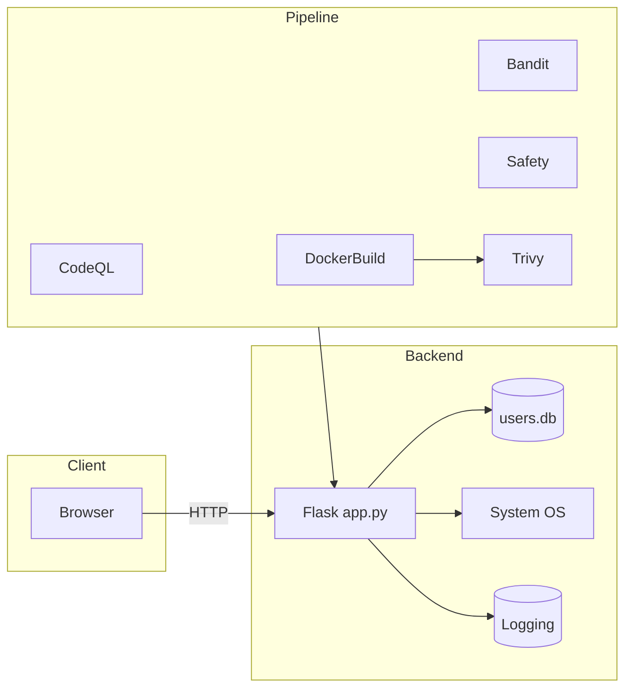
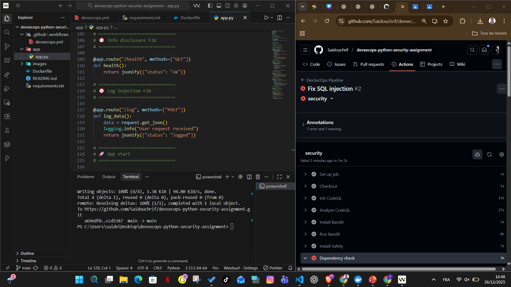
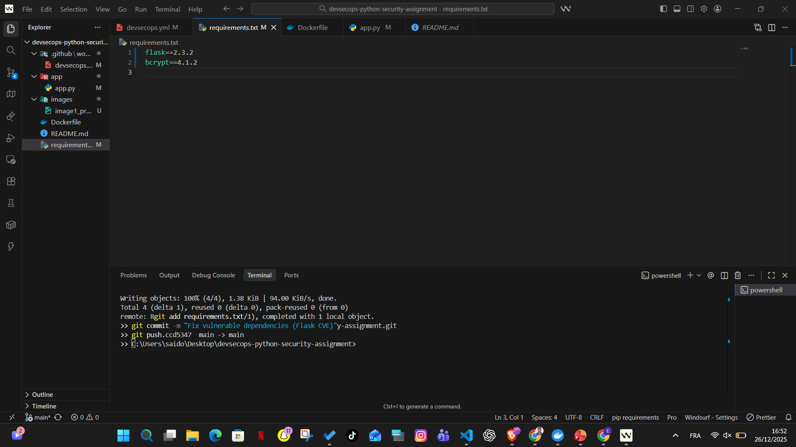
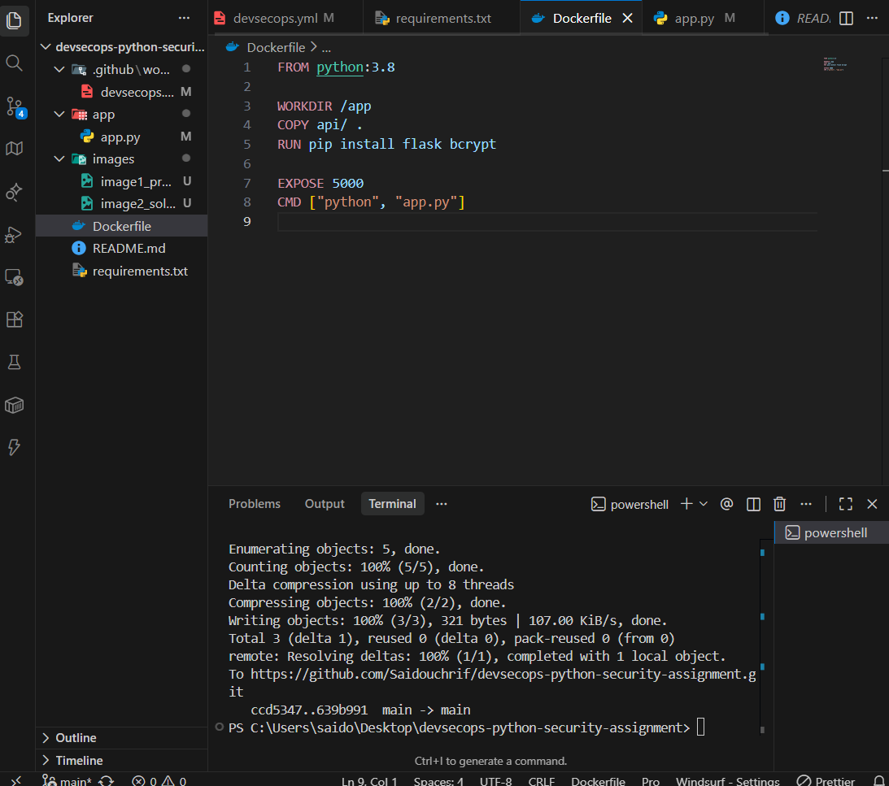
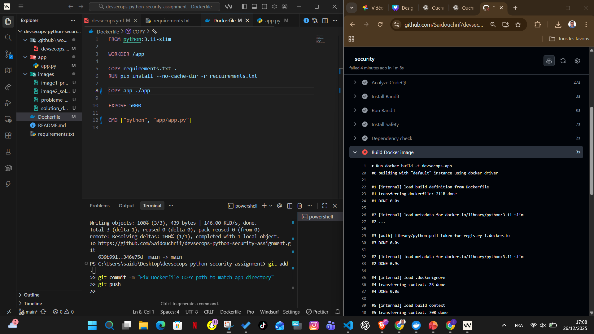
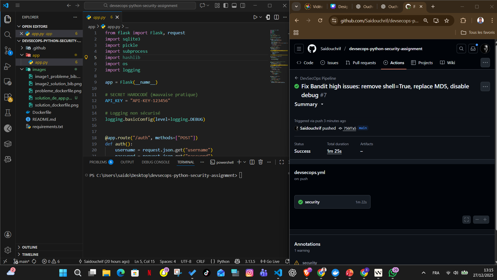

# DevSecOps Python Security Assignment

Projet pédagogique démontrant comment sécuriser une application Flask volontairement vulnérable grâce à un pipeline DevSecOps (SAST, analyse de dépendances, scan d’image Docker) et à des contre-mesures de code.

---

## 1. Architecture et composants

```text
.
├── app/
│   └── app.py          # Application Flask vulnérable
├── Dockerfile          # Image de déploiement
├── requirements.txt    # Dépendances (Flask, bcrypt)
└── .github/workflows/
    └── devsecops.yml   # Pipeline GitHub Actions
```

- **app/app.py** : expose plusieurs routes (`/auth`, `/exec`, `/deserialize`, etc.) contenant chacune une vulnérabilité courante.
- **Dockerfile** : image légère basée sur `python:3.11-slim` pour packager l’app.
- **Pipeline GitHub Actions** : orchestre CodeQL, Bandit, Safety, build Docker, puis scan Trivy.

---

## 2. Diagrammes UML

### 2.1 Diagramme de séquence d’authentification


### 2.2 Diagramme de composants


---

## 3. Vulnérabilités intentionnelles

| Route / fichier | Type de vulnérabilité | Impact potentiel | Stratégie de mitigation |
|-----------------|-----------------------|------------------|--------------------------|
| `/auth`         | Injection SQL         | Contournement d’authentification, exfiltration users | Requêtes paramétrées, ORM, stockage hashé des mots de passe |
| `/exec`         | Command Injection     | Exécution de commandes arbitraires | Validation stricte + `subprocess.run` avec liste autorisée |
| `/deserialize`  | Désérialisation non sûre (`pickle`) | RCE lors du chargement d’objets malveillants | Utiliser JSON/MessagePack, signer les charges utiles |
| `/encrypt`      | Initialement MD5      | Hash faible → rainbow tables | Bcrypt + facteur de coût |
| `/file`         | Path Traversal        | Lecture de fichiers sensibles | Nettoyage de chemins, sandbox (ex. `werkzeug.utils.safe_join`) |
| `/debug`        | Divulgation d’infos   | Exposition secrets/API_KEY/env | Désactiver debug, filtrer variables sensibles |
| `/log`          | Log injection         | Pollution des journaux | Normalisation / escapement des entrées utilisateur |

---

## 4. Pipeline DevSecOps (GitHub Actions)

Le workflow `.github/workflows/devsecops.yml` orchestre l’automatisation suivante :

1. **CodeQL (SAST)** : analyse statique dédiée Python.
2. **Bandit** : détection de vulnérabilités Python (échec si `severity=HIGH`).
3. **Safety** : scan des dépendances de `requirements.txt`.
4. **Build Docker** : construction de l’image `devsecops-app`.
5. **Trivy** : scan CVE de l’image, blocage en cas de vulnérabilités `HIGH` ou `CRITICAL`.

### Captures d’écran

1. **Problème dépendances (Safety)**  
   

2. **Résolution dépendances**  
   

3. **Dockerfile vulnérable**  
   

4. **Dockerfile corrigé**  
   

5. **Correctifs applicatifs**  
   

6. **Pipeline final réussi**  
   

---

## 5. Mise en route locale

### 5.1 Prérequis
- Python 3.11+
- pip

### 5.2 Installation
```bash
python -m venv .venv
# Windows PowerShell
.venv\Scripts\Activate.ps1
pip install --upgrade pip
pip install -r requirements.txt
python app/app.py
```
L’application écoute sur `http://localhost:5000`.

---

## 6. Exécution avec Docker

```bash
docker build -t devsecops-app .
docker run -it --rm -p 5000:5000 devsecops-app
```

---

## 7. Exécution du pipeline

1. Forker ou cloner le dépôt.
2. Pousser une branche sur GitHub → déclenchement automatique (`push` sur `main`).
3. Consulter l’onglet **Actions** pour suivre CodeQL, Bandit, Safety, build Docker et Trivy.

---

## 8. Aller plus loin

- Ajouter des tests unitaires + pytest dans la pipeline.
- Intégrer un scanner DAST (OWASP ZAP) sur l’artefact Docker.
- Remplacer SQLite par une base sécurisée (PostgreSQL) et secret management (GitHub OIDC + Vault).
